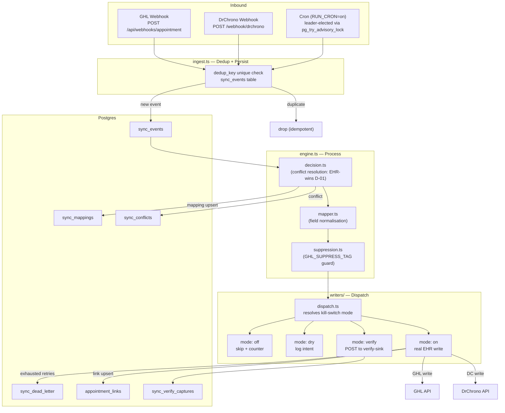

# Sync Architecture — GHL ↔ DrChrono Bidirectional

**Last updated:** 2026-06-08 (P12 docs sweep)
**Engine:** `tlpapps/app/src/modules/sync/`
**Related docs:** `sync-runbook.md` · `database.md` · `api-sync.md` · `.planning/MONGO-EOL.md`

---

## End-to-End Flow



---

## Mapping Shape

The sync engine maintains a bidirectional identity bridge in `sync_mappings`:

```
sync_mappings
  kind        : 'patient' | 'appointment'
  drchrono_id : DrChrono entity ID (string)
  ghl_id      : GHL entity ID (string)
  location_id : FK → locations.id (scopes the mapping to a practice)
  origin      : 'drchrono' | 'ghl' | 'backfill'
  version     : monotonically increasing (optimistic concurrency)
  last_synced_at
  last_hash   : fingerprint of last-synced payload (detects drift)
```

For patients, `patients.id` (PG UUID) is the canonical internal ID. `patient_external_ids` stores per-system external IDs (system ∈ `{'ghl','drchrono','embodi','silkone'}`). `appointment_links` stores GHL event ↔ DrChrono appointment pairs per location.

---

## Kill-Switch Matrix

Four independent gates control write enablement. Default state is `dry` (log-only, no EHR mutation).

| Gate env var | Direction | Entity scope | Values | Default |
|-------------|-----------|-------------|--------|---------|
| `SYNC_WRITE_DRCHRONO_TO_GHL` | DrChrono → GHL | all entity types | `off` · `dry` · `verify` · `on` | `dry` |
| `SYNC_WRITE_GHL_TO_DRCHRONO` | GHL → DrChrono | all entity types | `off` · `dry` · `verify` · `on` | `dry` |

**Mode semantics:**

| Mode | Effect | EHR touched? | Metric |
|------|--------|--------------|--------|
| `off` | Skip entirely | No | `sync_writes_skipped_off` |
| `dry` | Log write intent | No | (logged, no counter) |
| `verify` | Build real envelope, POST to verify-sink | No (sink only) | `sync_verify_captures` row |
| `on` | Invoke real writer | Yes | `sync_writes_attempted`, `sync_writes_succeeded`, `sync_writes_failed` |

**Verification sink** (`verify` mode): `POST /api/sync/verify-sink` (built-in) or override via `SYNC_VERIFY_SINK_URL`. Each capture stored in `sync_verify_captures` with the full outbound envelope (url, method, headers, body) — human-inspectable proof of correct write emission before going live.

**Flip procedure:** Coolify → `tlpapps` service → Environment variables → set gate → Save + Redeploy (rolling restart, zero-downtime). Full runbook: `sync-runbook.md` §1.

---

## GHL Automation Suppression

Every synced contact write carries the suppression tag defined by `GHL_SUPPRESS_TAG` (default: `"Existing Patient"`). Owner's GHL automation workflows are filtered to exclude this tag, preventing double-booking or duplicate follow-up sequences on synced patients.

Additionally, `GHL_SUPPRESS_AUTOMATION` (default: `true`) forces `dnd: true` on every synced contact write as a backstop. Set `GHL_SUPPRESS_AUTOMATION=false` only after verifying all GHL workflows are tagged-filtered.

---

## Conflict Resolution (D-01)

EHR-authoritative policy: **DrChrono wins** on field-level conflicts. When both systems have a divergent value for the same field:

1. DrChrono value is applied.
2. Conflict recorded in `sync_conflicts` (`resolution: pending`).
3. Admin UI (`/admin/conflicts`) displays for manual review.
4. Auto-resolved conflicts are marked `auto-resolved`; manual override sets `manual-resolved`.

Shadow-read conflicts (store comparison during PG migration, `source='shadow'`) are categorised as `expected` (known schema normalisation) vs `real` (data divergence). Only `real` count against cutover criteria (D-09).

---

## Cron Leader Election (D-04)

When `RUN_CRON=on`, only one replica runs the sync cron loop. Leader election uses:

```sql
SELECT pg_try_advisory_lock($1, $2)  -- session-scoped, auto-released on crash
```

`$1 = SYNC_LEADER_KEY_BASE` (default `910700`) — namespaces this app's locks. `$2 = kind_hash` — one lock per cron kind. Implementation: `src/modules/sync/leader.ts`.

---

## Idempotency

Webhook deduplication via `sync_events.dedup_key` (UNIQUE index). Engine composes:

```
${source}:${action}:${external_id}:${version}
```

Duplicate `dedup_key` on INSERT → silently dropped (ON CONFLICT DO NOTHING). GHL origin-tagged writes carry `originTag = 'tlp-sync'` to prevent echo-loop re-ingestion.

---

## Metrics + Observability

- **Metrics endpoint:** `GET /api/sync/metrics` — JSON (default) or Prometheus (`Accept: text/plain`)
- **Counters:** `sync_events_received`, `sync_events_processed`, `sync_events_failed`, `sync_writes_attempted`, `sync_writes_succeeded`, `sync_writes_failed`, `sync_writes_skipped_off`, `sync_conflicts_total`, `sync_dead_letter_total`
- **Telegram alerts:** 5 alert types with 10-minute per-type deduplication (P10)
- **Admin UI pages:** `/admin/dashboard`, `/admin/events`, `/admin/conflicts`, `/admin/dead-letter`
- **OpenAPI spec:** `GET /openapi.json` (sync module only); Scalar UI at `/docs`

---

## Environment Variables (Sync)

| Variable | Default | Purpose |
|----------|---------|---------|
| `SYNC_WRITE_DRCHRONO_TO_GHL` | `dry` | Kill switch: DrChrono → GHL writes |
| `SYNC_WRITE_GHL_TO_DRCHRONO` | `dry` | Kill switch: GHL → DrChrono writes |
| `SYNC_VERIFY_SINK_URL` | (built-in) | Override verify-sink target URL |
| `RUN_CRON` | `off` | Enable cron-driven sync loop |
| `SYNC_LEADER_KEY_BASE` | `910700` | PG advisory lock namespace |
| `GHL_SUPPRESS_TAG` | `Existing Patient` | Tag added to all synced GHL contacts |
| `GHL_SUPPRESS_AUTOMATION` | `true` | Force dnd on synced contacts |
| `DRCHRONO_WEBHOOK_SECRET` | — | DrChrono webhook HMAC secret (required for P09+) |
